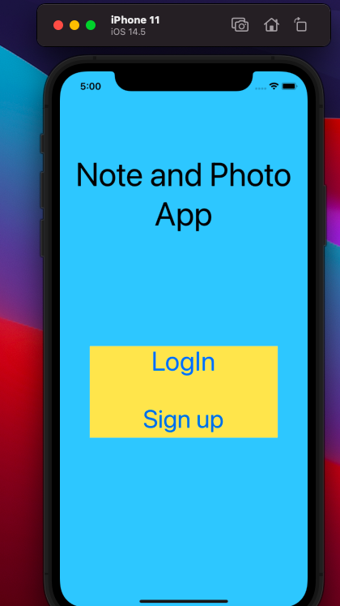
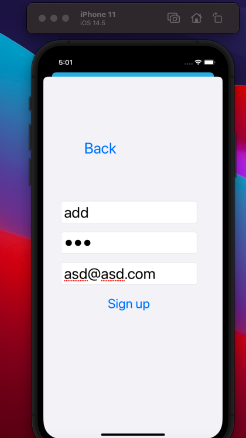
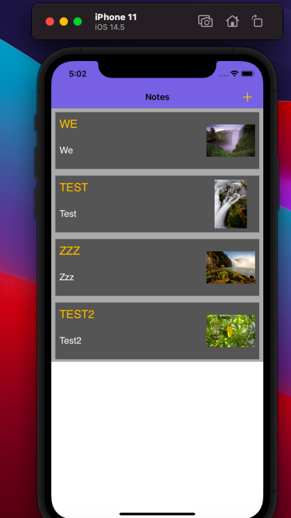
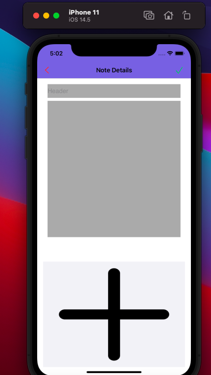
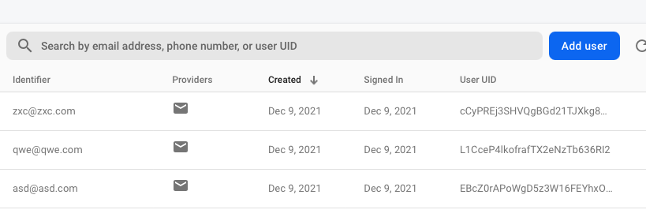
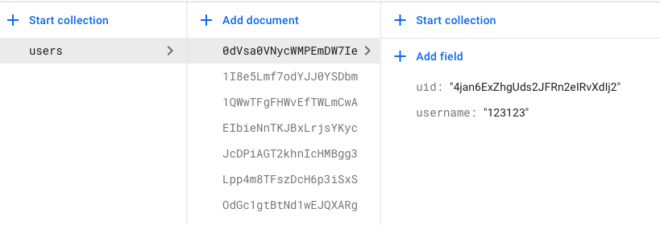

# CSC690-Final-project

# Member:
Haozhan Li(Only one)

# Intro
A Photonote App which can add some note, and APP can create acount that the data store on firebase.

Once the account create successful, and those info will send to firestore database

# Install  

Go to the folder of project repository

  `- pod init`

  `- pod install`

# Features

# Must have:
- Signup
- Login
- Add Note
- show notes

# Nice have:
-add photo

# API
- Firebase

# Screenshot

-Only tested on iphone11

-an unknown crash may happen to type in password on Signup page.

If it happened restart the app,and make sure type in password after the input keyboard disappeared

(should may need to wait a few second after click password text field).

an account have been created for useing to test firebase

email:asd@asd.com

password:123456

